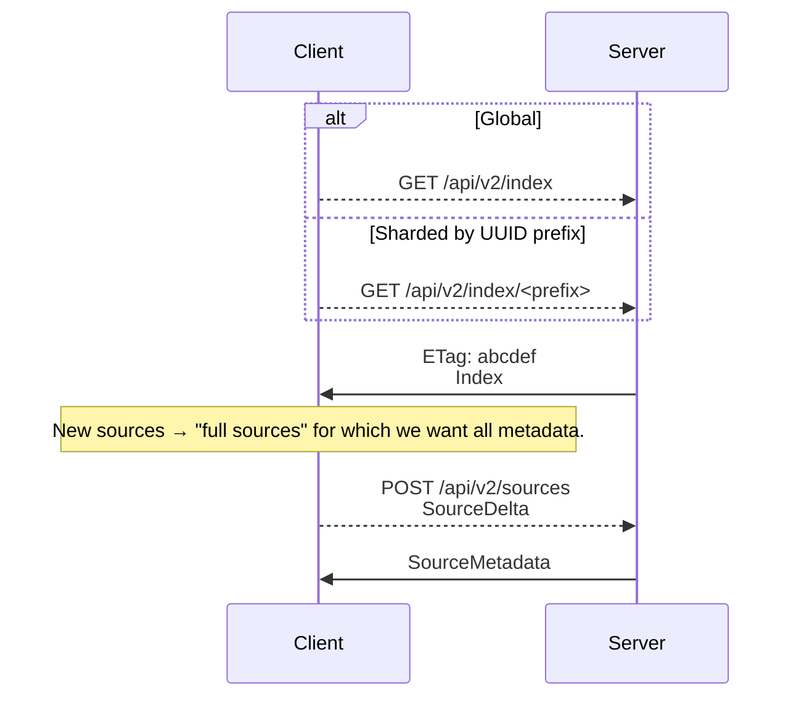
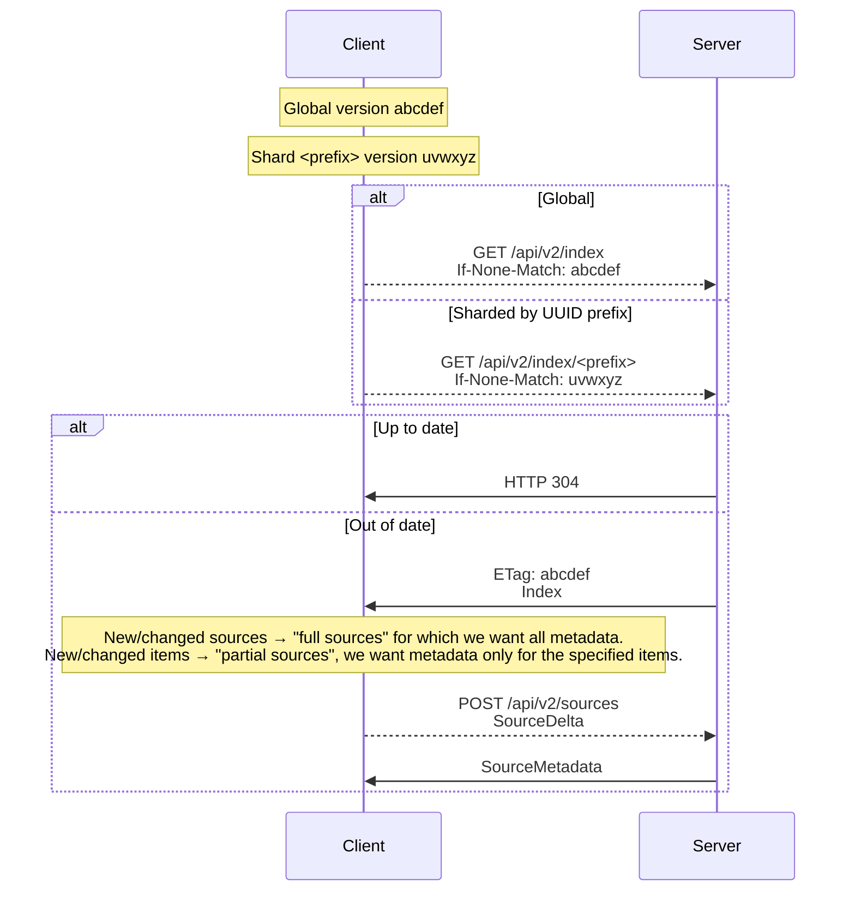

# Journalist API v2

This package implements and documents the synchronization strategy for the v2
Journalist API.

| File                                  | Contents                             |
| ------------------------------------- | ------------------------------------ |
| `README.md`                           | Specification                        |
| `__init__.py`                         | Server implementation                |
| `../../tests/test_journalist_api2.py` | Test suite for server implementation |

A client-side implementation should be able to interact with the endpoints
implemented in `__init__.py` according to this specification.

## Overview

The request/response schemas referred to in these sequence diagrams are defined
as mypy types in `__init__.py`.

### Initial synchronization

### Incremental synchronization

