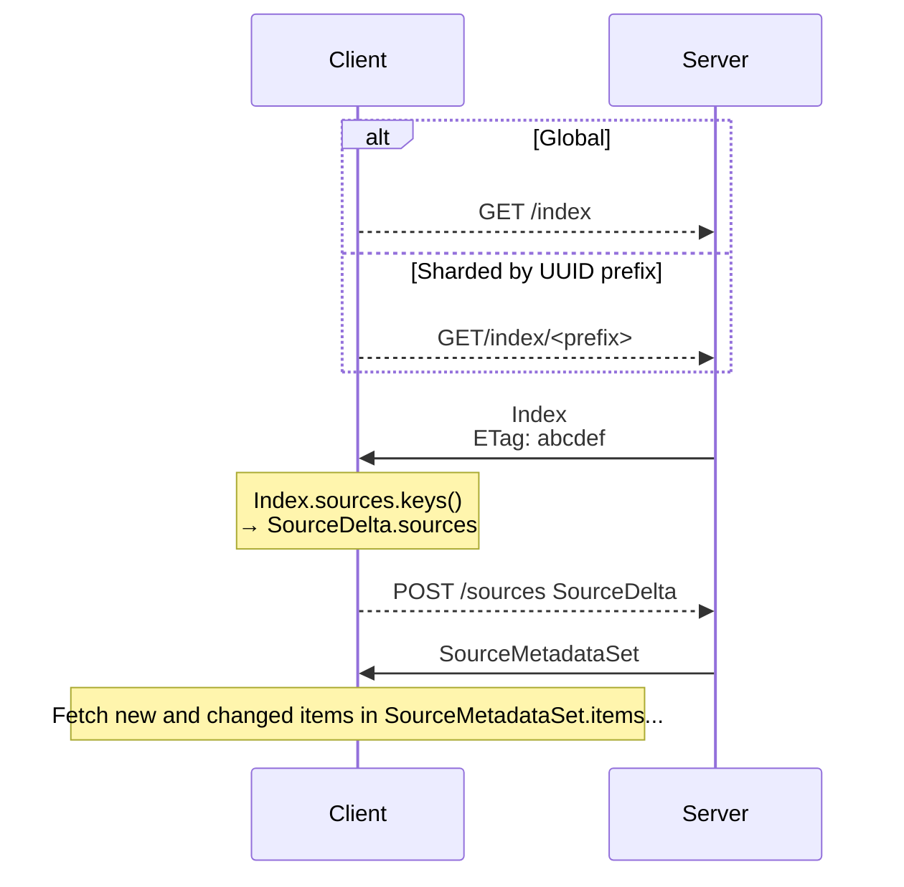
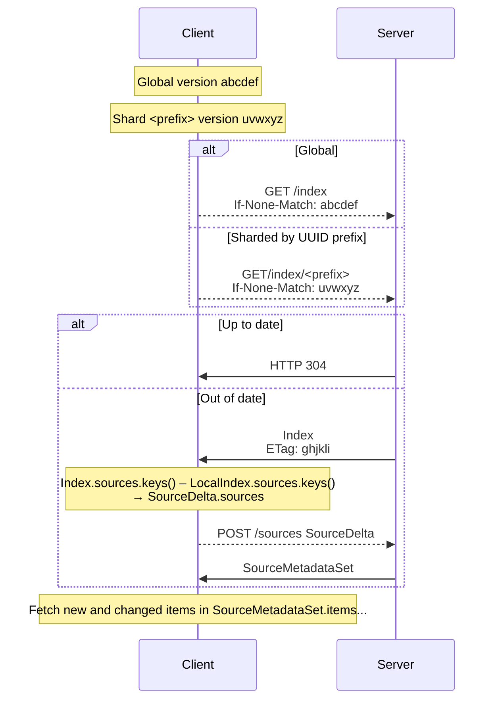

# Journalist API v2

This package specifies the synchronization strategy for the v2 Journalist API,
including:

1.  A semi-[literate] reference implementation in Python of the structures and
    algorithms for versioning and diffing resources, which can be easily
    replicated in another language (e.g., TypeScript). You can view this
    documentation in the development shell with:

        $ python -m pydoc journalist_app/api2/__init__.py

2.  An initial set of test vectors. To keep this file self-contained and
    self-testing, these are implemented here as doctests, but they should also
    be easily replicated in another language. You can run these tests inside the
    development shell with:

        $ python -m doctest journalist_app/api2/__init__.py

3.  A scaffold (i.e., schemas and stubs) for the endpoints the new API provides.
    Most raise `NotImplementedError`; a few are implemented for demonstration.
    You can view the OpenAPI specification that flask-smorest generates from
    this scaffold by running `make dev`, logging into the Journalist Interface,
    and navigating to <http://localhost:8081/docs>.

    The OpenAPI specification can also be used to generate TypeScript types
    including JSON Schema validation (via openapi-typescript) and/or full API
    clients (via openapi-generator).

[literate]: https://en.wikipedia.org/wiki/Literate_programming

## Overview

### Initial synchronization

### Incremental synchronization

## API v2

* -> GET /index
* <- Reply {"sources":{"UUID":{"version": ..., "collection": {"UUID":version}}}
* -> POST /sources {"full_sources": [UUIDs...], "partial_sources":{"source UUID":[item UUIDs...]}}
* <- Reply {"sources":{"UUID":{"version": ..., "info":..., "collection":{"UUID": {"version":..., "info":...}}}}}
